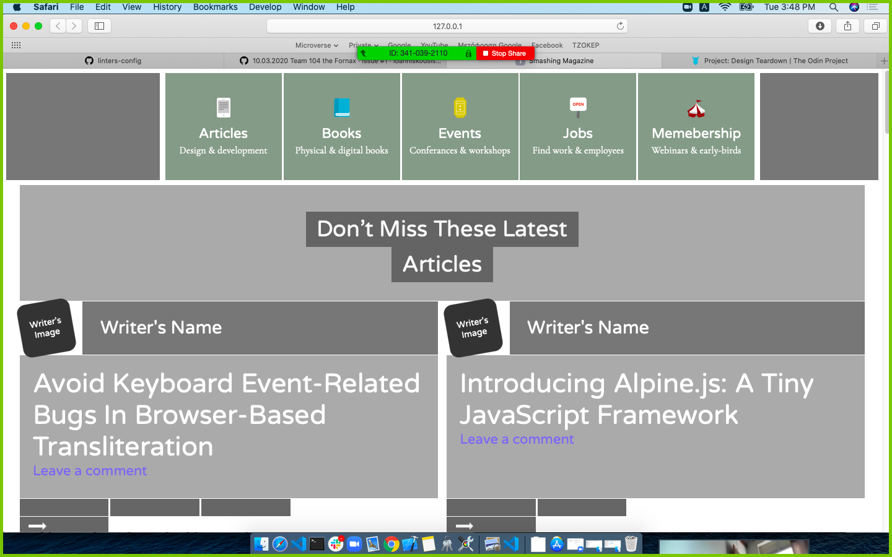

# Design_Teardown [Collaborative project]
The goal for this project is to illustrate the terms of visual hierarchy, typography and design principles.
Additionally makes use of grid and flex design styles.

> The structure of the index page (index.html) is based on the Smashing Magazine main page

Illustration of the terms of visual hierarchy, typography and design principles

## Built With

- HTML,
- CSS

## Live Demo

[Live Demo Link](https://rawcdn.githack.com/ioanniskousis/Design_Teardown/838fed6e969c21cfd44ee6d12b81b6db264508eb/index.html)

## Getting Started

To get a local copy up and running follow these simple example steps.

### Prerequisites

#### You should have installed git on your local machine and a text editor preferably VS Code.

### Setup

#### Clone the repository into your local machine.

## 👤 Authors

### Author1
## Ioannis Kousis

- Github: [@ioanniskousis](https://github.com/ioanniskousis)
- Twitter: [@ioanniskousis](https://twitter.com/ioanniskousis)
- Linkedin: [Ioannis Kousis](https://www.linkedin.com/in/ioannis-kousis-9a5051b4/)

### Author2
## Odong Sunday

- Github: [@OdongAlican](https://github.com/OdongAlican)
- Twitter: [@odongsandie](https://twitter.com/odongsandie)
- Linkedin: [Odong Sunday](https://www.linkedin.com/in/sunday-alican-odong-b99226b7/)

## 🤝 Contributing

Contributions, issues and feature requests are welcome!

Feel free to check the [issues page](issues/).

## Show your support

Give a ⭐️ if you like this project!

## Acknowledgments

- Appreciation to my coding Partner Odong Sunday and mentor

## 📝 License

This project is [MIT](lic.url) licensed.
